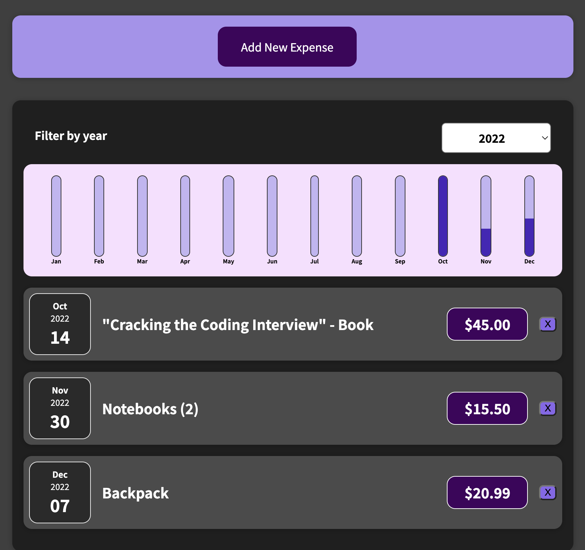
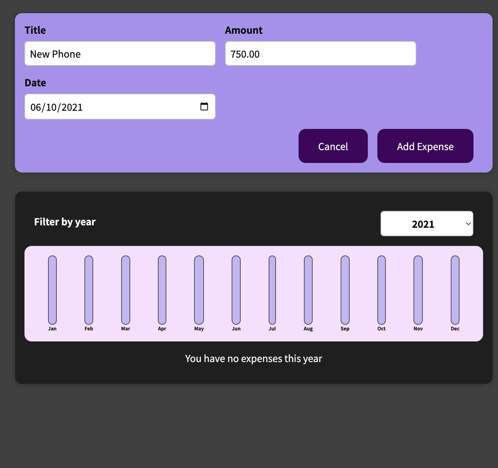
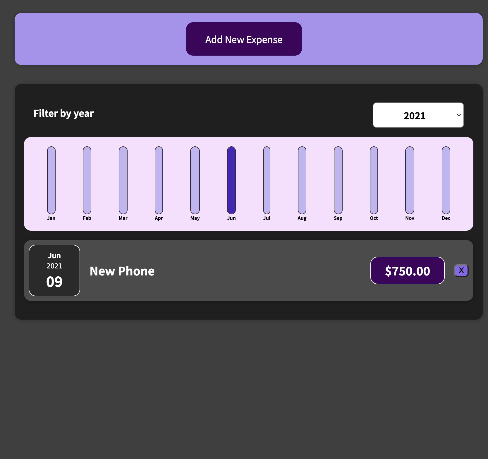

# Expense Tracker

## Description

A simple web application to track your expenses throughout each year.
Add a new expense and compare your monthly expenses within that year with other expenses easily with the dynamic chart.

Built using ReactJS

## Live Link

## Screenshots

